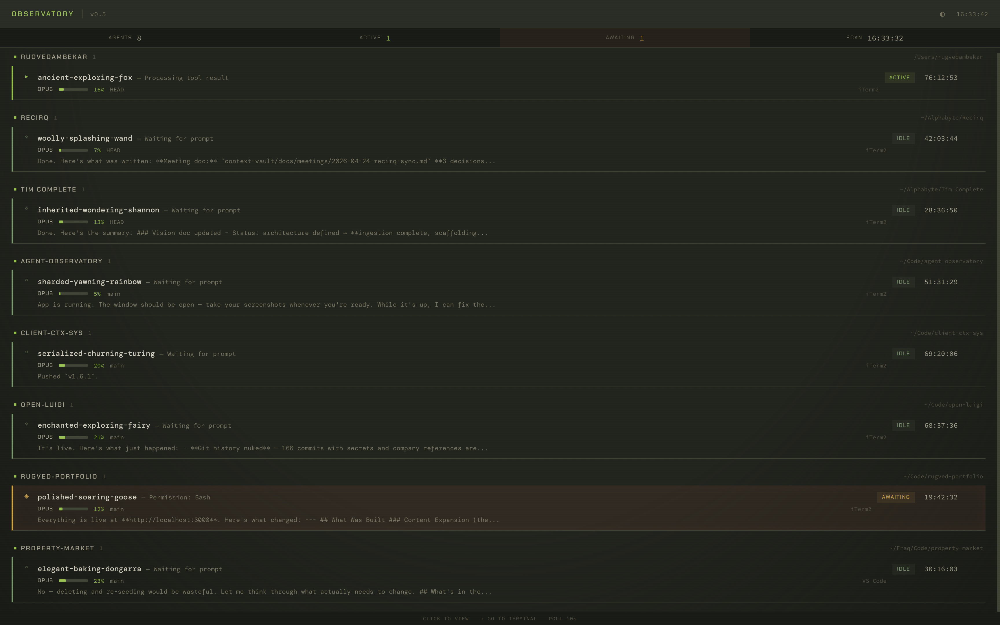
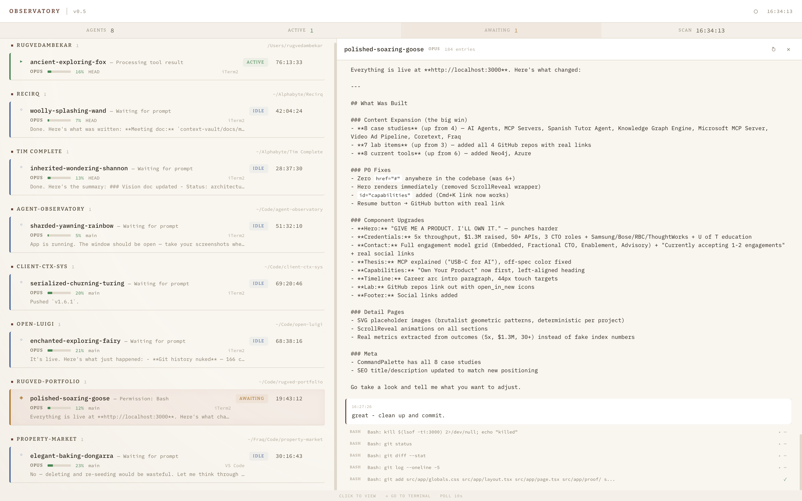

# Agent Observatory

**Real-time desktop dashboard for all your Claude Code sessions.**

A native macOS app that discovers every active Claude Code session on your machine, groups them by project, and gives you live status, context usage, conversation history, and one-click terminal navigation — without touching your workflow.

No database. No cloud. No accounts. Fully stateless — it scans live state on every launch.





## Features

- **Auto-discovery** — finds all running Claude Code sessions from `~/.claude/sessions/`
- **Grouped by project** — sessions organized by git repository root
- **Live status** — two-layer detection: JSONL tail parsing + optional hook receiver for instant updates
- **Model & context** — shows Opus/Sonnet/Haiku, context window usage bar (input + cache tokens)
- **Conversation viewer** — split-pane UI with merged tool operations and compact message display
- **Click-to-focus** — jump to the exact terminal tab (iTerm2 tab-level via AppleScript, app activation for others)
- **Permission prompts** — surfaces when a session is waiting for input
- **3 themes** — nightfall (dark), fieldcom (military green), warmdesk (warm cream)
- **Git-aware** — shows current branch per session
- **Stateless** — no persistence, no SQLite, no config files to manage

## Requirements

- **macOS** — uses `proc_pidpath`, `KERN_PROCARGS2`, and AppleScript (no Windows/Linux support)
- **Rust** (1.77.2+) and **Bun** — for building
- **Claude Code** — sessions must be running for anything to appear

## Quick Start

```bash
# Clone
git clone https://github.com/Rugved-Rakebma/agent-observatory.git
cd agent-observatory

# Install frontend dependencies
cd frontend && bun install && cd ..

# Run in dev mode
just dev
```

Or build a release binary:

```bash
just build
```

The `.app` bundle lands in `frontend/src-tauri/target/release/bundle/macos/`.

## How It Works

### Session Discovery

Every 10 seconds, the backend scans `~/.claude/sessions/*.json` for active session files. Each file contains a PID, session ID, and working directory. Dead PIDs are filtered out. Sessions are grouped by git repository root.

### Two-Layer Status Detection

**Layer 1 — JSONL parsing** (`enrichment.rs`): Reads the last 32KB of each session's JSONL log file (`~/.claude/projects/{encoded_cwd}/{sessionId}.jsonl`). Infers status from the last message type, `stop_reason`, and file modification time. Extracts model, slug, context usage, git branch, and last assistant message.

**Layer 2 — Hook receiver** (`hooks.rs`): An axum server on `127.0.0.1:7890` accepts POST events from Claude Code hooks. Hook status takes priority over JSONL inference for real-time accuracy. Falls back gracefully if hooks aren't configured.

### Terminal Detection

Reads `TERM_PROGRAM` from each Claude process via `KERN_PROCARGS2` to identify iTerm2, Terminal.app, Ghostty, Warp, VS Code, etc.

### Click-to-Focus

For iTerm2: AppleScript targets the specific tab by matching the session's tty. For other terminals: activates the application window.

## Hook Setup (Optional)

Hooks give you instant status updates instead of waiting for the 10-second poll. Without hooks, the app still works — it just relies on JSONL inference.

Create `~/.claude/hooks/features/observatory.sh`:

```bash
#!/bin/bash
# POST hook events to Agent Observatory
EVENT="$1"
SESSION_ID="$2"
CWD="$3"

curl -sf -o /dev/null \
  -X POST "http://127.0.0.1:7890/hook" \
  -H "Content-Type: application/json" \
  -d "{\"event\":\"$EVENT\",\"sessionId\":\"$SESSION_ID\",\"cwd\":\"$CWD\"}"
```

Then wire it into your Claude Code hooks config to fire on `PreToolUse`, `PostToolUse`, `Notification`, and `Stop` events.

## Architecture

```
frontend/
  src/                        Svelte 5 + Tailwind 4
    routes/+page.svelte       Main dashboard UI
    app.css                   Theme system + animations
  src-tauri/src/
    lib.rs                    Tauri setup, commands, poll timer
    scanner.rs                Session discovery, PID validation, terminal detection
    enrichment.rs             JSONL parsing, mtime cache, metadata extraction
    hooks.rs                  axum hook receiver (port 7890)
```

**Stack**: Tauri 2 (Rust) + Svelte 5 + Tailwind 4 + axum + tokio

## Development

```bash
just dev        # dev mode with hot reload
just build      # release binary
just check      # cargo check backend
just frontend   # frontend only (no Tauri shell)
```

## License

MIT
